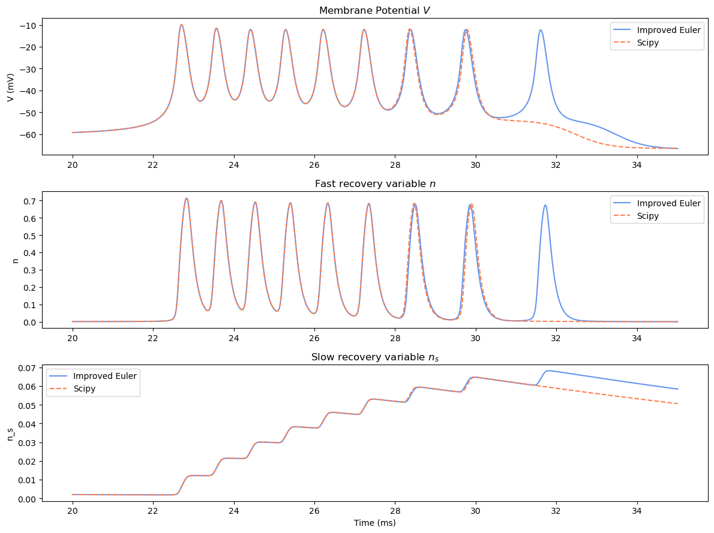
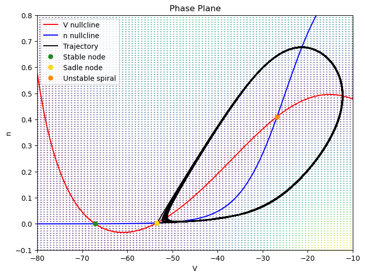

# Neuronal Bursting  

This repository houses a **Python implementation** of a **minimal bursting neuron model**, based on a **three-variable ordinary differential equation (ODE) model** proposed by **Ghigliazza and Holmes** [1].  

The code was developed as a final project for the course **"Nonlinear Dynamics, Chaos, and Applications" (NWI-NB068B)**  

## Model Description  

The neural dynamics of the model are governed by the following system of equations:  

$$
C\dot{V} = I - g_L (V - E_L) - g_{Na} m_{\infty}(V) (V - E_{Na}) - g_K n (V - E_K) - g_{\text{slow}} n_s (V - E_K) \tag{1}
$$  

$$
\dot{n} = (n_{\infty}(V) - n) \frac{1}{\tau_n} \tag{2}
$$  

$$
\dot{n_s} = \frac{(n_{s,\infty}(V) - n_s)}{\tau_{\text{slow}}} \tag{3}
$$  

The gating variables **n** and **n_s** evolve according to **sigmoid functions** of the form:  

$$
f_{\infty} = (1 + \exp((V_{\text{half}} - V) / k))^{-1}
$$  

where **k** and **V_half** are model parameters.  Below is an illustration of the gating variable dynamics:  

  

---

## Features  

This implementation allows users to

- **Simulate neural bursting** with different parameter sets and initial conditions.  
- **Visualize time series** of the membrane potential for different ODEs.
- **Analyze phase portraits** of the neuron model.  

  

The attached **report** provides a detailed discussion of the model, the numerical methods used, and the results obtained.  

## Reference  

[1] Ghigliazza, Raffaele M., and Philip Holmes.  *"Minimal models of bursting neurons: How multiple currents, conductances, and timescales affect bifurcation diagrams."* SIAM Journal on Applied Dynamical Systems **3.4** (2004): 636-670. 